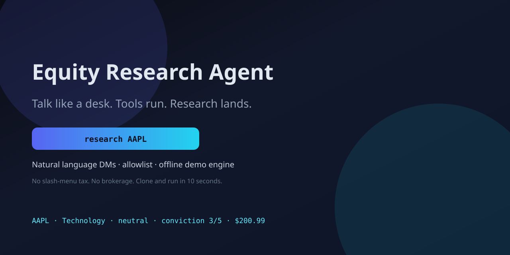
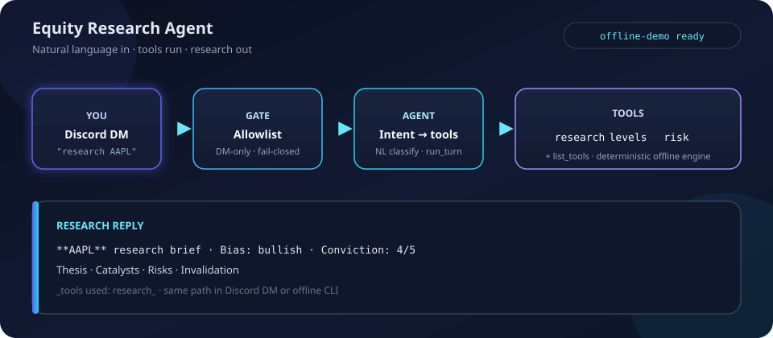

<p align="center">
  
</p>


<p align="center">
  <strong>Equity Research Agent</strong> - natural-language equity research.<br/>
  You talk. The agent runs tools. A structured brief lands (thesis, levels, risk).<br/>
  <em>Discord DM adapter included. Not a slash-command toy. Not brokerage glue.</em>
</p>

<p align="center">
  <a href="https://github.com/SamsonCyber/equity-research-agent/actions/workflows/ci.yml"></a>
  
  
  
  
</p>

<p align="center">
  <a href="#try-it-in-10-seconds"><strong>Try offline</strong></a> |
  <a href="assets/interactive-demo.html"><strong>Interactive demo</strong></a> |
  <a href="#discord-setup">Discord setup</a> |
  <a href="docs/PRODUCTION_TOOLS.md">Production tool catalog</a>
</p>

---

## The product in one glance

<p align="center">
  
</p>

That mock is **not marketing fiction**. The reply body is generated from the same offline engine as:

```bash
python -m equity_research_agent.demo research AAPL
```

| You say | What happens |
|---|---|
| `research AAPL` | Thesis, bias, conviction, catalysts, risks, invalidation |
| `levels on NVDA` | Support / resistance ladder around a shared ref price |
| `risk for TSLA` | ATR%, beta, demo stop, risk/share, 1R target |
| `help` | Tool catalog |

**DM-only. Fail-closed allowlist. No guild spam.**

---

## Try it in 10 seconds

No Discord token. No market API keys. No account.

```bash
git clone https://github.com/SamsonCyber/equity-research-agent.git
cd equity-research-agent
python -m venv .venv
# Windows: .venv\Scripts\activate
# POSIX:   source .venv/bin/activate
python -m pip install -e ".[dev]"
python -m pytest -q
python -m equity_research_agent.demo research AAPL
```

Also:

```bash
python -m equity_research_agent.demo levels on NVDA
python -m equity_research_agent.demo "risk for TSLA"
python -m equity_research_agent.demo help
```

### Click-through demo (no install)

Open the in-repo UI (self-contained HTML, engine payloads baked in):

**[assets/interactive-demo.html](assets/interactive-demo.html)**

Pick AAPL / NVDA / TSLA / MSFT / AMD and flip research | levels | risk. Same deterministic engine as the CLI.

---

## Live sample (checked in)

Exact `run_turn("research AAPL")` output. Full file: [`docs/samples/aapl-research.txt`](docs/samples/aapl-research.txt).

~~~~text
**AAPL | research**
`as_of offline-demo` | Apple | Technology | paper research only

**Read** | INFERRED
Apple (AAPL) is range-bound in this offline model. No edge until a clean break with volume. Size small or wait; fake breaks are the default.

**1 | Tape** | VERIFIED (demo OHLCV)
Last **$200.99** (-1.75%) | heavy volume (~1.8x avg)

**2 | Lean** | INFERRED
**neutral / range (INFERRED)** | conviction **med**

**3 | Catalysts** | PROBABLE
- Range break with expanding volume
- Catalyst calendar (earnings / product / event)
- Technology leadership change that pulls the name

**4 | Risks** | PROBABLE
- Whipsaw inside the range
- Low-liquidity fake break
- Macro headline risk that rewrites the tape

**Invalidation**
Two closes outside $194.96-$207.02 (demo band)

_Demo research data only. Offline / deterministic. Not live market data. Not financial advice._

_tools used: research_
~~~~

Regenerate showcase assets after engine changes:

```bash
python scripts/build_showcase.py
```

---

## Architecture

<p align="center">
  
</p>

```text
  natural language  ->  allowlist gate  ->  intent classify  ->  tools  ->  research reply
       DM only           fail-closed         research|levels|risk         + tools footer
```

| Module | Role |
|---|---|
| [`bot.py`](src/equity_research_agent/bot.py) | Discord DM gateway |
| [`agent.py`](src/equity_research_agent/agent.py) | NL turn: intent -> tools -> reply |
| [`tools.py`](src/equity_research_agent/tools.py) | Tool registry |
| [`research.py`](src/equity_research_agent/research.py) | Offline deterministic engine |
| [`auth.py`](src/equity_research_agent/auth.py) | Fail-closed allowlist |
| [`demo.py`](src/equity_research_agent/demo.py) | Offline CLI |

---

## Tools in this package

| Tool | Card you get |
|---|---|
| `research` | Company, sector, bias, conviction, price, thesis, catalysts, risks, invalidation |
| `levels` | Shared ref price, pivot, support/resistance ladder |
| `risk` | ATR heat, beta, demo stop, risk/share, 1R target |
| `list_tools` | Catalog (`help`) |

Every card is tagged **`offline-demo`**: deterministic per ticker, not live market data.

Famous symbols (AAPL, NVDA, TSLA, ...) resolve to real sectors and company names so demos look intentional. Prices stay synthetic.

### Private production surface

A private deploy can keep this UX and grow into a large research tool graph (charts, fundamentals, SEC/EDGAR, thesis memory, macro packs, ...).

That inventory is **documented, not shipped live here**:

**[docs/PRODUCTION_TOOLS.md](docs/PRODUCTION_TOOLS.md)** (~72 tools, owner view)

---

## Discord setup

1. [Discord Developer Portal](https://discord.com/developers/applications) -> bot
2. Enable **Message Content Intent**
3. Allowlist your Discord user ID
4. DM the bot (guild messages ignored on purpose)

```bash
cp .env.example .env
# STOCK_RESEARCH_DISCORD_TOKEN=...
# STOCK_RESEARCH_ALLOWED_USER_IDS=your_id
python -m equity_research_agent.bot
```

| Variable | Required | Purpose |
|---|---|---|
| `STOCK_RESEARCH_DISCORD_TOKEN` | yes | Bot token |
| `STOCK_RESEARCH_ALLOWED_USER_IDS` | yes | Comma-separated user IDs |
| `STOCK_RESEARCH_ALLOWED_USER_IDS_FILE` | no | File of IDs |

Empty allowlist -> **process refuses to start**.

```bash
python scripts/live_smoke.py   # connect check; never prints the token
```

---

## Why it is not another stock bot

| Typical Discord bot | This |
|---|---|
| `/price AAPL` | `what do you think about AAPL?` |
| Fixed command surface | Intent -> tool registry |
| Guild channel noise | **DM-only** research path |
| Open to everyone | **Fail-closed allowlist** |
| Live quote cosplay without auth | Honest **offline-demo** labels |

Same product shape as a serious research agent: **you talk, tools run, research comes back.**

---

## License

MIT. See [LICENSE](LICENSE).
